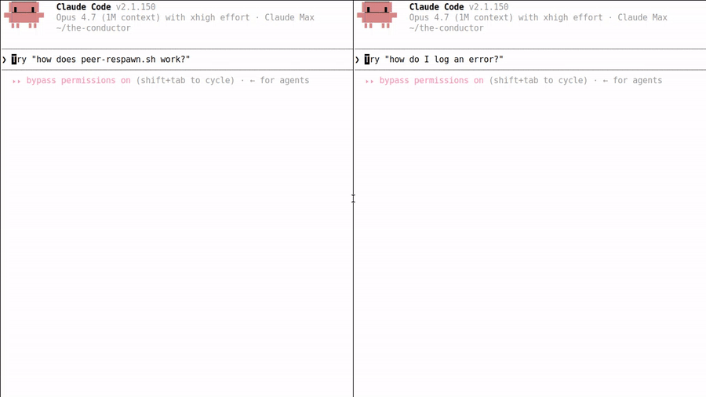

# claude-code-fleet-notify



> *Real cross-instance notification + ack flow between two live Claude Code sessions. See `demo/README.md` for the recording setup.*


Turn scattered AI terminals into a supervised tmux fleet: dispatch work to Claude Code, Codex, Gemini, Grok, or any **hookable** REPL CLI, then get `done`/`error`/`interrupted` outcomes back inline so the supervisor can update the plan instead of babysitting panes.

Latest release: see [Releases](https://github.com/palios-taey/claude-code-fleet-notify/releases) (the README never hardcodes a version — it goes stale).

`claude-code-fleet-notify` gives each terminal-native, hookable CLI session a Redis inbox, four lifecycle hooks, and one local daemon. Active sessions receive full messages through hook `additionalContext`; stopped sessions are woken by a tmux-injected pointer prompt, while full message bodies remain in Redis.

## Set it up with Claude Code (AI-native)

Point your Claude Code (or any agent) at this repo and tell it: **"set up claude-code-fleet-notify on this machine."** Everything it needs is below and is exercised verbatim by CI, so an agent can follow it end to end:

1. `git clone` this repo and `cd` in.
2. Install Redis + tmux (runtime deps), then `pip install redis python-dotenv`.
3. `bash scripts/install-hooks.sh --apply` — copies hooks to a stable runtime root, runs a boot gate that proves every hook imports before writing any settings, and wires your CLI's hook config.
4. `bash scripts/start_notify_daemons.sh start` — one local daemon per machine.
5. Smoke test: `taey-notify <target> "hello"` then `taey-ack --node <target> --peek`.

The **`readme-as-a-stranger`** CI gate runs these exact steps on a fresh GitHub VM on every PR — if the setup above is wrong, that check goes red and the change can't merge. That gate *is* the guarantee an agent can stand this up from zero.

## Scope (what this is and what this isn't)

In scope:
- **Terminal-native REPL CLIs that expose hook events**: Claude Code, OpenAI codex, Google gemini (field-verified), xAI grok (field-verified with dedicated Grok hooks).
- Single-machine tmux fleets where the daemon, hooks, and supervisor sessions share one Redis.

Out of scope (will fail silently or partially — adopters: don't):
- **IDE-embedded agents** (Cursor, Continue, GitHub Copilot Workspace, etc.) — extension-host IPC sits below the tmux/process boundary our hooks observe, so critical task state transitions are missed.
- **Many-to-many distributed graph topologies** — the supervisor↔worker abstraction here is point-to-point with optional multi-level via explicit `parent` override. Fanout/aggregate workflows need a different layer.
- **Non-hookable REPLs** — if a CLI has no equivalent of Stop / UserPromptSubmit / Pre+PostToolUse (or comparable lifecycle events), the universal Stop+notify primitive has nothing to attach to and the daemon's pointer injection won't have a UserPromptSubmit hook on the receiving side to drain the inbox.

> **Integration verification status**: Claude Code (field-verified, the original target). xAI grok (field-verified with dedicated `~/.grok/hooks/cf-notify.json`, including boot-time `SessionStart` idle marking). OpenAI codex (integration-tested via the per-CLI hook variants; field-verified on the Mira fleet via per-parent peers). Google gemini (integration-tested via the per-CLI hook variants; field-verified via the same per-parent peers, with the known BeforeTool/AfterTool event-name mapping).

## Supported CLIs

| CLI | Config file | Event names | Install command |
|---|---|---|---|
| Claude Code | `~/.claude/settings.json` | `PreToolUse` / `PostToolUse` / `Stop` / `UserPromptSubmit` | `install-hooks.sh --apply` |
| OpenAI codex | `~/.codex/hooks.json` | same as Claude Code | `install-hooks.sh --codex --apply` |
| Google gemini | `~/.gemini/settings.json` | `BeforeTool` / `AfterTool` / `BeforeAgent` / `AfterAgent` | `install-hooks.sh --gemini --apply` |
| xAI grok | `~/.grok/hooks/cf-notify.json` | `SessionStart` / `UserPromptSubmit` / `Stop` | copy `templates/grok/cf-notify.json`; see `docs/grok-hooks.md` |

All four CLIs share the same Redis state machine via per-CLI hook variants that route through one shared `hooks/_shared.py` helper where the CLI exposes those events. The supervisor-worker primitive (v0.2.0 universal Stop+notify) works identically across them: when a worker stops, its Stop hook resolves the supervisor (via `taey:<worker>:parent` override or `<name>-codex` / `<name>-gemini` / `<name>-grok` suffix-strip), reads `taey:<worker>:current_task` (set by the dispatcher) + `taey:<worker>:last_outcome` (optionally set by the worker), and pushes a single `peer_idle` message with the outcome inline.

> The supervisor-worker dispatch + plan/task tracking + recurring-runner pieces ship in the companion product [`claude-code-fleet-orchestrator`](https://github.com/palios-taey/claude-code-fleet-orchestrator), which depends on this package.

For the live status of notify, daemon, handoff, trace, wake-packet integration,
and delegated orchestrator capabilities, see
[docs/CAPABILITIES.md](docs/CAPABILITIES.md).

## claudemesh

This is complementary to claudemesh, not a replacement. If you want interactive multi-session coordination, see claudemesh. If you want autonomous wake for unattended Claude Code fleets, use this.

The architectural split is the wake invariant: `Stop` sets durable idle, prompt/tool activity clears idle, and the daemon only injects a pointer when `idle=1`. A v0.1.x/v0.2 backlog item is to propose that autonomous-wake invariant upstream to claudemesh.

## Install

### Fresh Clone Smoke Install

This is the same workflow enforced by `.github/workflows/stranger-install.yml` on a fresh GitHub Actions VM.

```bash
git clone https://github.com/palios-taey/claude-code-fleet-notify.git
cd claude-code-fleet-notify
python3 -m pip install redis python-dotenv
export PATH="$PWD/scripts:$PATH"
```

Redis and tmux are runtime requirements. For a first smoke, start Redis however your machine does it; on Ubuntu that is commonly `sudo apt-get install redis-server tmux && redis-server --daemonize yes`.

Optional system-wide CLI install:

```bash
sudo make install
```

This installs `taey-notify`, `cc-fleet-notify`, `taey-ack`, `tmux-send`, and `start_notify_daemons.sh` into `${PREFIX:-/usr/local}/bin`.

## Configure

```bash
export REDIS_HOST=127.0.0.1
export REDIS_PORT=6379
export NOTIFY_KEY_PREFIX=taey
```

`NOTIFY_KEY_PREFIX` defaults to `taey`. Use a different value when several fleets share one Redis instance.

Create a `.env` from [.env.example](.env.example) when you want hook subprocesses to pick up the same settings automatically.

For a sandboxed hook install that does not touch your real CLI settings:

```bash
export CF_INSTALL_DIR="$PWD/.sandbox/hooks-runtime"
export CLAUDE_SETTINGS_PATH="$PWD/.sandbox/claude/settings.json"
export CODEX_HOOKS_PATH="$PWD/.sandbox/codex/hooks.json"
export GEMINI_SETTINGS_PATH="$PWD/.sandbox/gemini/settings.json"
```

### Orchestrator integration

The Stage B stop-discipline hooks need access to `claude-code-fleet-orchestrator`.

Use one of these two approaches:

1. Install the orchestrator package so `lib.orch_schema` and `lib.config` are importable.
2. Set `ORCH_REPO_ROOT=/absolute/path/to/claude-code-fleet-orchestrator`.

If neither is true, importing `hooks/_shared.py` fails loud with a named `OrchestratorImportError`.

Optional integration settings:

- `ORCH_API_BASE` for the tasks API base URL
- `CF_SUPPORT_REPO_ROOT` only if you want repeated Stage B engine failures to open a support bug lock
- `CF_STAGE_B_ENABLED=1` or `CF_STAGE_B_MARKER_PATH=/path/to/marker` to activate Stage B

## Install Hooks

Default behavior is Claude Code only:

```bash
bash scripts/install-hooks.sh                # dry-run, print diff
bash scripts/install-hooks.sh --apply        # write changes after review
```

For codex and/or gemini, pass the corresponding flags:

```bash
bash scripts/install-hooks.sh --codex --apply             # + codex
bash scripts/install-hooks.sh --gemini --apply            # + gemini
bash scripts/install-hooks.sh --all --apply               # claude + codex + gemini
```

Each CLI's settings file gets a timestamped backup before being written. Without `--apply`, the installer is dry-run only — it prints the unified diff and writes nothing. `bash scripts/install-hooks.sh --help` for the full flag list.

The installer copies `hooks/*.py`, `notifications/*.py`, and `identity.py` to a stable runtime root (default `~/.local/share/claude-code-fleet-notify/hooks-runtime`, override with `--install-dir=` or `CF_INSTALL_DIR`) and writes hook commands that reference **only the runtime copies** — never the checkout you ran the installer from. Moving, renaming, or deleting a checkout therefore cannot affect hook execution. Re-running the installer refreshes the runtime copies; that is the update mechanism. A `.env` beside the runtime hooks is seeded from the checkout's `.env` on first install and never overwritten afterwards — edit `$CF_INSTALL_DIR/.env` (or the path passed to `--install-dir`) to change live hook configuration.

In `--apply` mode the installer also runs a boot gate before writing settings: every runtime hook that would be referenced by a settings file must import cleanly from the runtime root with no checkout `PYTHONPATH` help. If the boot gate fails, no settings file is written.

> **Grok** (xAI `grok-cli`) should use the dedicated global hook file `~/.grok/hooks/cf-notify.json` so `SessionStart` can mark idle at boot. See `docs/grok-hooks.md`.

## Run The Daemon

Run one daemon per machine that hosts Claude Code tmux sessions:

```bash
bash scripts/start_notify_daemons.sh start
bash scripts/start_notify_daemons.sh status
bash scripts/start_notify_daemons.sh stop
```

Smoke the Redis round trip:

```bash
taey-notify session-b "README stranger round-trip" --from session-a
taey-ack --node session-b --peek
taey-ack --node session-b
```

## Usage

```bash
taey-notify session-b "build is ready"
cc-fleet-notify session-b "same command through the alias"
taey-notify session-b "production deploy failed" --type escalation
taey-notify session-b "cycle done" --type heartbeat --priority low
```

Read your own inbox:

```bash
taey-ack --peek
taey-ack
```

## Protocol

See [NOTIFICATION_PROTOCOL.md](NOTIFICATION_PROTOCOL.md).

The Redis key layout is:

```text
${NOTIFY_KEY_PREFIX:-taey}:SESSION:inbox
${NOTIFY_KEY_PREFIX:-taey}:SESSION:notifications
${NOTIFY_KEY_PREFIX:-taey}:notify:SESSION:orch
${NOTIFY_KEY_PREFIX:-taey}:SESSION:idle
${NOTIFY_KEY_PREFIX:-taey}:SESSION:last_activity
${NOTIFY_KEY_PREFIX:-taey}:SESSION:last_tool_activity
```

## Testing

```bash
python3 -m py_compile identity.py notifications/*.py hooks/*.py tests/*.py
python3 -m unittest discover -s tests
```

or:

```bash
make test
```

## License

[Apache-2.0](LICENSE)
